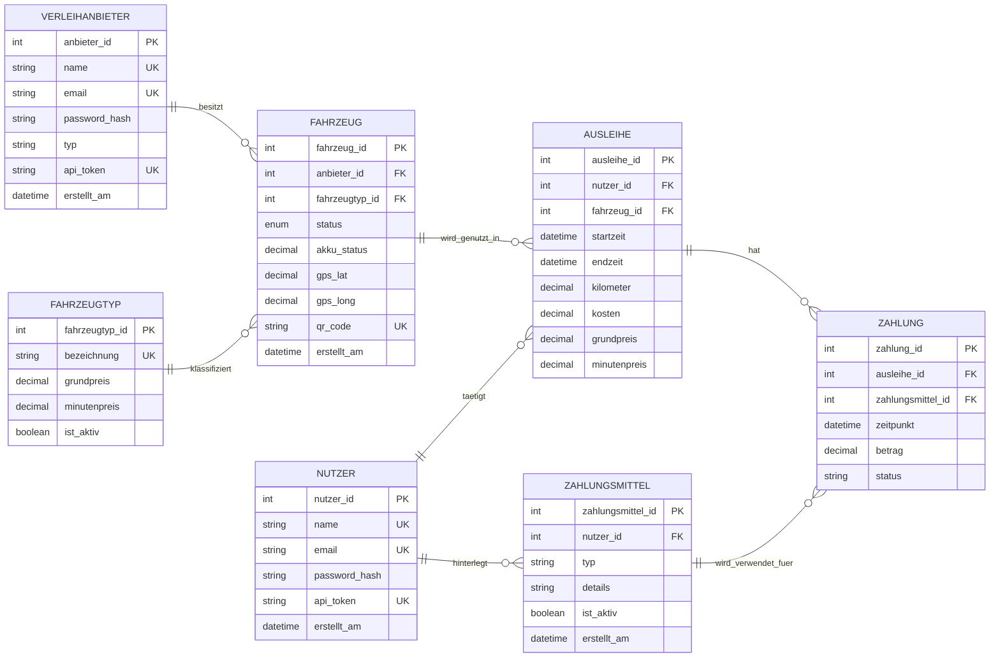
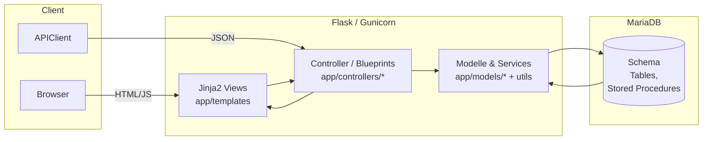
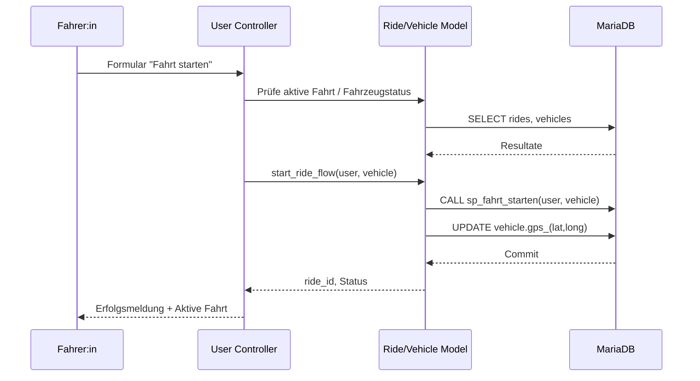
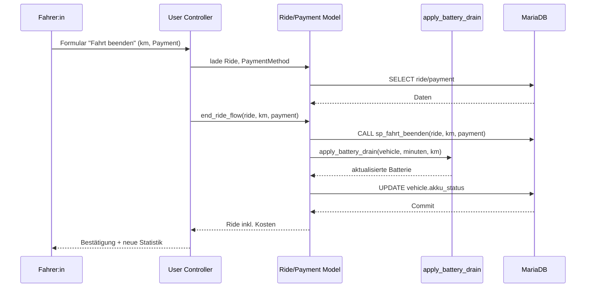
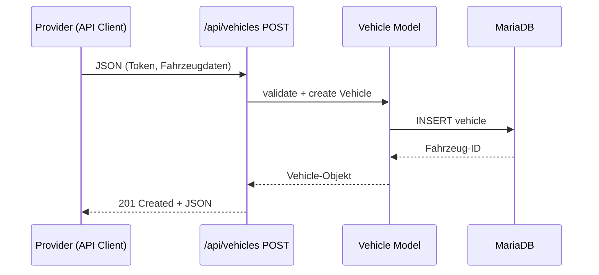
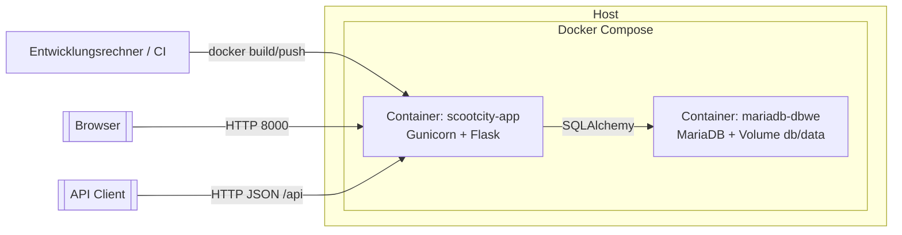

# 5 Systemarchitektur



## 5.1 Datenmodell (ERM)

Das Mermaid-Diagramm entspricht `erm.mmd` und bildet alle Kernobjekte ab:

- **Verleihanbieter** besitzen beliebig viele Fahrzeuge. Attribute wie `typ` (Firma/Privat) steuern Workflows.
- **Fahrzeuge** enthalten den Fahrzeugtyp (z.B. E-Scooter), Status, Akku und GPS. Sie verweisen auf einen Anbieter und generieren QR-Codes für das Unlocking.
- **Nutzer** (Fahrer:innen) besitzen mehrere Ausleihen und Zahlungsmittel.
- **Ausleihen** verknüpfen Nutzer und Fahrzeuge; sie speichern Start-/Endzeit, Kilometer, Kosten und historische Tarife.
- **Zahlungsmittel** gehören zu einem Nutzer und enthalten anonymisierte Details. Mehrere Zahlungen können dasselbe Zahlungsmittel verwenden.
- **Zahlungen** referenzieren Ausleihe und Zahlungsmittel und dokumentieren Betrag sowie Status (`bezahlt`, `offen`, etc.).

Die Kardinalitäten sichern Geschäftsregeln: Ein Fahrzeug kann gleichzeitig nur in einer Ausleihe sein, Zahlungen gehören genau zu einer Ausleihe, Nutzer dürfen mehrere Zahlungsmittel hinterlegen. Das Schema ist normalisiert und verhindert doppelte Datenhaltung.

## 5.2 Systemarchitektur (MVC)



Die Darstellung zeigt den klassischen MVC-Aufbau: Die Blueprints bilden die Controller-Schicht, rufen Modelle sowie Utilities auf und liefern Daten an Jinja-Views oder JSON-Antworten. Clients greifen entweder via Browser (HTML) oder API-Client (JSON) darauf zu. MariaDB stellt persistente Daten bereit; Stored Procedures ergänzen die Business-Logik auf Datenbankseite.

Für den Fahrten-Lifecycle werden die Stored Procedures auch tatsächlich genutzt: `start_ride` und `end_ride` rufen auf MariaDB/MySQL direkt `CALL sp_fahrt_starten(...)` bzw. `CALL sp_fahrt_beenden(...)` auf. Für SQLite-Testläufe existiert bewusst ein ORM-Fallback, damit automatisierte Tests ohne MariaDB weiterhin ausführbar bleiben.

## 5.3 Komponentenübersicht

```mermaid
graph TD
    subgraph Web
        A[Auth Controller]
        U[User Controller]
        P[Provider Controller]
    end
    subgraph API
        API[API Controller]
        Spec[OpenAPI Spec]
    end
    subgraph Services
        Utils[Auth, RideFlow, Vehicle, Time Utils]
        QR[QR Generator]
    end
    subgraph Data
        Models[SQLAlchemy Models]
        Schema[db/schema.sql]
    end
    A --> Models
    U --> Models
    P --> Models
    API --> Models
    Models --> Schema
    API --> Spec
    U --> Utils
    P --> Utils
    U --> QR
    P --> QR
```

Die Komponenten interagieren wie folgt:

- Die drei Web-Controller bedienen die Browser-UI.
- `api_controller` stellt JSON-Endpunkte bereit und nutzt die OpenAPI-Spezifikation.
- Utilities (Auth, RideFlow, Vehicle, Time, QR) kapseln wiederverwendbare Logik.
- Modelle greifen auf das SQL-Schema zu; Stored Procedures leben in `db/schema.sql`.

## 5.4 Sequenzdiagramme wesentlicher Abläufe

### 5.4.1 Fahrt starten



### 5.4.2 Fahrt beenden inkl. Payment



### 5.4.3 Fahrzeug per API anlegen



## 5.5 Deployment- und Infrastrukturübersicht



`docker-entrypoint.sh` initialisiert beim Start das Schema via `scripts/init_db.py`. Konfiguration (DB-URL, Tarife, BASE_URL, Secret Key) erfolgt über Environment-Variablen bzw. `compose.yml`. Die Container sind entkoppelt, sodass MariaDB durch einen Managed Service ersetzt werden könnte. Gunicorn kann über zusätzliche Worker skaliert werden; Logs laufen über stdout und lassen sich via `docker logs` sammeln.

## 5.6 Abweichungen & Technologiebegründung

Die Aufgabenstellung erlaubt mehrere relationale DB-Systeme. Im Unterricht wurde vor allem **MSSQL** behandelt, in diesem Projekt kam jedoch **MariaDB** zum Einsatz. Gründe:

- **Konsistenz mit dem Stack**: MariaDB passt nahtlos zur Python/Flask-Umgebung (SQLAlchemy + PyMySQL) und reduziert Konfigurationsaufwand.
- **Docker-Support**: Für MariaDB existieren schlanke, gut dokumentierte Container-Images; das Setup ist lokal und im Deployment identisch reproduzierbar.
- **Kosten/Nutzung**: MariaDB ist Open-Source und in der Praxis häufig im Web-Stack anzutreffen, was Betrieb und Hosting vereinfacht.
- **Abgrenzung zu MSSQL**: MSSQL wäre möglich, würde aber zusätzliche Treiber/Tooling benötigen und die Installationshürde erhöhen, ohne einen funktionalen Mehrwert für die Anforderungen zu liefern.
